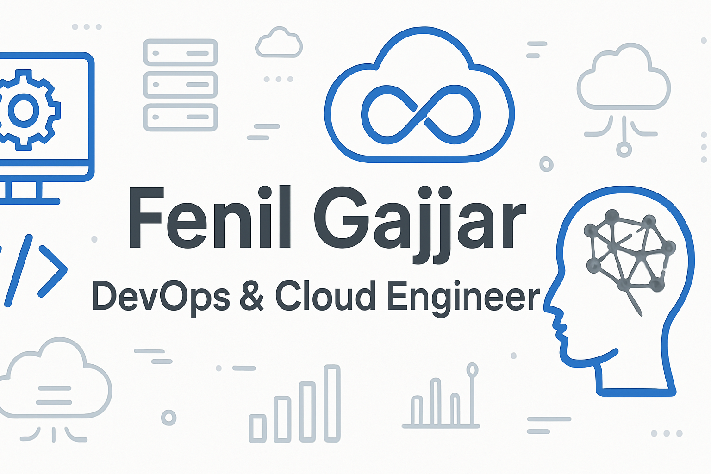

  

# Hi there 👋, I'm Fenil Gajjar!

## About Me

I'm a final-year Computer Engineering student specializing in **computer systems, cloud computing, and DevOps practices**. I'm passionate about leveraging technology to drive efficiency and innovation.

## Skills

### Technologies & Tools

**Cloud:** AWS (EC2, EBS, EFS, VPC, Lambda, Route53, ALB, S3, ECS, ECR, IAM, RDS, SSM, Cloudwatch, Elastic Beanstalk)

**Container Orchestration:** Docker & Kubernetes (EKS, KOPS), Helm

**Infrastructure as Code & Configuration Management:** Terraform, Ansible

**CI/CD:** Jenkins, GitHub Actions, ArgoCD

**Build & Artifact Management:** Maven, Nexus

**Scripting & Programming:** Bash, Python

**Security & Load Balancing:** SonarQube, Trivy, OWASP, Nginx

**Observability:** Prometheus, Grafana, ELK stack

**Version Control:** Git & GitHub

## Projects

### Featured Projects

#### Migration and Re-architecture of Multi-Tier Java Application on AWS

Migrated a multi-tier Java application (Tomcat, MySQL, RabbitMQ, Memcache) to AWS using a two-phase approach. Phase 1 involved architecting a high-availability setup with ELB, Auto Scaling Groups, Route 53, security groups, S3-based CI/CD, and SSL termination, achieving 99.9% uptime. Phase 2 re-architected the application using managed cloud services (Elastic Beanstalk, RDS, ElastiCache, Amazon MQ), reducing operational overhead by 60%. Implemented CloudFront CDN, multi-AZ deployment, and an automated Maven pipeline.

#### Capstone Automated DevSecOps Workflow for Cloud-Native Deployment

Orchestrated an automated DevSecOps pipeline for a Spring Boot application using Jenkins CI/CD, with integrated security scanning (Trivy), code quality analysis (SonarQube), and artifact management (Nexus). Provisioned AWS EKS infrastructure via Terraform, containerized with Docker, and implemented GitOps deployment with SSL/TLS and Prometheus/Grafana monitoring, achieving shift-left security practices across the entire SDLC.

#### GitOps-Based VProfile Cloud-Native Deployment

Engineered an automated GitOps pipeline using GitHub Actions, Terraform, and AWS EKS for end-to-end infrastructure provisioning and application deployment. Implemented CI/CD workflow with Docker/ECR containerization, Helm charts, SonarCloud quality gates, and automated testing, reducing deployment time and ensuring zero-downtime releases.

## Connect with me

- **Email:** fenilgajjar.devops@gmail.com
- **GitHub:** [Fenil-Gajjar](https://github.com/Fenil-Gajjar)
- **Google Drive:** [Fenil Gajjar's Portfolio](https://drive.google.com/drive/folders/1Q3xFSLoeoiH38VCsGFYLD5Q3nYHXD0647usp=sharing)

